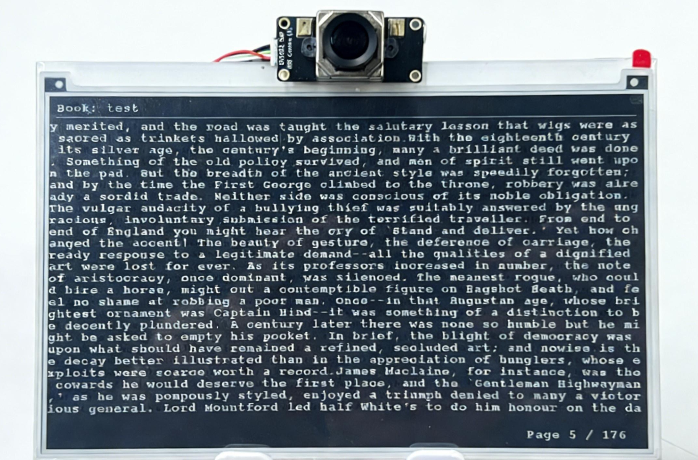

# E-Ink Reader

[中文](README_zh.md) | English

## Project Overview

This project is a smart e-ink screen reader based on the [Quectel Pi H1 Smart Single-Board Computer](https://developer.quectel.com/doc/sbc/Quectel-Pi-H1/en/Applications/Open-Source-Projects/e_ink_reader/e_ink_reader.html). The system combines the low-power display characteristics of e-ink screens with camera-based eye-tracking technology to achieve a natural page-turning reading experience without manual operation. Page turning is controlled by detecting changes in the user's eye gaze, and physical buttons are used as auxiliary input to improve system reliability.

In terms of display, the system adopts a partial refresh and partition rendering strategy, supports automatic typesetting and continuous reading of Chinese and English text, and also has page memory and quick wake-up functions, making it suitable for long-term reading and embedded smart terminal application scenarios.



## 🌟 Core Features

| Feature | Description |
|---------|-------------|
| **Eye-tracking Page Turning** | Page turning is achieved by detecting eye movement direction. When reaching the bottom of the reader, simply looking towards the top of the screen triggers the page turn |
| **Smart Screen Off** | Automatically turns off the screen after a set time if no face is detected, protecting privacy and saving battery power |
| **Multi-language Support** | Supports correct rendering of pure English, pure Chinese (GB2312), and mixed Chinese-English text |
| **Automatic Typesetting** | No character cropping, automatic line wrapping, supports cross-page content continuation, Chinese first-line indentation |
| **Page Memory** | Supports returning to previous pages with pixel-level consistency, accurately recording reading position |
| **Multi-book Management** | Supports switching between different books via long-press physical buttons |
| **Efficient Refresh** | Uses partial refresh technology to reduce flickering and improve refresh speed |

## 👁️ Eye-tracking Control Instructions

### Startup Process
1. After running bulid.sh, the system simultaneously launches the eye-tracking script and e-ink display program
2. The camera automatically detects available devices and begins monitoring eye movements
3. Initialization takes 4 seconds - maintain normal reading posture during this period

### Page Turning Operations
- **Next Page**: Maintain a reading posture and read at a normal pace, starting from the top of the screen and moving downwards. When your gaze reaches the bottom of the screen, simply shift your eyes back to the top to trigger the page turn
- **Previous Page**: Requires physical button operation
- **Page Turn Cooldown**: 1-second cooldown between page turns to prevent accidental triggers

### Screen Off/Wake-up Function
- **Auto Screen Off**: Automatically sends screen-off signal after 4 seconds of no face detection
- **Auto Wake-up**: Automatically wakes the screen when face is detected again
- **Event Cleanup**: Clears input events during screen-off period upon wake-up to prevent accidental page turns

## ⌨️ Physical Button Functions

- **Short Press Button KEY1**: Turn to next page
- **Short Press Button KEY2**: Turn to previous page
- **Long Press Button KEY1**: Switch to next book
- **Long Press Button KEY2**: Switch to previous book

## 🛠️ System Requirements

### Hardware Requirements
- **Main Controller**: Quectel Pi H1 Smart Single-Board Computer
- **Display**: Waveshare 7.5" Black and White E-Ink Display
- **Camera**: OV5693 USB Camera (for eye tracking)
### E-Ink Display Pin Connections
| EPD Pin | BCM2835 Numbering | Board Physical Pin |
|---------|-------------------|--------------------|
| VCC     | 3.3V              | 3.3V               |
| GND     | GND               | GND                |
| DIN     | MOSI              | 19                 |
| CLK     | SCLK              | 23                 |
| CS      | CE0               | 24                 |
| DC      | 25                | 22                 |
| RST     | 17                | 11                 |
| BUSY    | 24                | 18                 |
| PWR     | 18                | 12                 |
### Software Requirements

- Operating System: Debian 13 (Quectel Pi H1 default system)
- Python version: Python 3.9~3.12
- Dependencies:
    - OpenCV-Python == 4.8.1.78
    - MediaPipe == 0.10.9
    - evdev == 1.9.2
    - numpy == 1.24.3

## 🚀 Complete Deployment Guide

### Get Project Source Code
1. Create e-ink-reader folder in single-board computer terminal:
```bash
mkdir -p /home/pi/e-ink-reader
cd /home/pi/e-ink-reader
```

2. Clone project source code to this directory

3. Modify file permissions:
```bash
sudo chmod -R 755 /home/pi/e-ink-reader
```

### Configure Python Environment
System default Python is 3.13, but MediaPipe requires Python 3.9-3.12 (Python 3.10 is pre-installed):

```shell
# Backup current Python link
sudo cp /usr/bin/python3 /usr/bin/python3.backup
# Remove current Python link
sudo rm /usr/bin/python3
# Create new link to Python 3.10
sudo ln -s /usr/bin/python3.10 /usr/bin/python3
# Verify modification
ls -l /usr/bin/python3
python3 --version
```

### Activate Python Virtual Environment
Execute the following command to create and activate a Python virtual environment:
```bash
python3.10 -m venv ~/mediapipe_env
source ~/mediapipe_env/bin/activate
```

### Install Python Dependencies
In demo-inkscreen-reader directory:
```bash
pip install --upgrade pip
pip install -r requirements.txt
```

Install evdev separately:
```bash
sudo ln -s /usr/bin/aarch64-linux-gnu-gcc /usr/bin/aarch64-qcom-linux-gcc
CPPFLAGS="-I/usr/include/python3.13 -I/usr/include/python3.10" CFLAGS="-I/usr/include/python3.13 -I/usr/include/python3.10" pip3 install --no-binary evdev evdev==1.9.2
```

###  Compile E-Ink Display Driver
Compile the e-ink reader program in e-ink-reader/demo-inkscreen-reader/components/e-Paper/Quectel-Pi-H1/c directory. If the epd file appears in this directory, the compilation is successful:
```bash
cd /home/pi/e-ink-reader/demo-inkscreen-reader/components/e-Paper/Quectel-Pi-H1/c
make CC=gcc EPD=epd7in5V2
```

###  Create udev Rules File
First enter the following command to create and open the udev rules file:
```bash
sudo nano /etc/udev/rules.d/99-uinput.rules
```

Add the following statement to the file, press **"ctrl + o" + Enter** to save the edited content, then press **"ctrl + x"** to exit editing:
```
KERNEL=="uinput", MODE="0660", GROUP="input"
```

### Add input Group
Add user to input group:
```bash
sudo usermod -aG input pi 
```

###  Enable SPI Function
Enter the following command in terminal to enable SPI function:
```bash
sudo qpi-config 40pin set
```

###  Verify Configuration
1. After restarting the system, enter the following command in the terminal to verify whether the user is in the input group and the udev rule configuration:
```bash
ls -l /dev/uinput
groups
```

2. Verify SPI functionality:
```bash
ls /dev/spi*
```

###  Configure Password-less Execution
Enter the following command in terminal to configure password-less execution of `epd` program:
```bash
echo "pi ALL=(ALL) NOPASSWD: /home/pi/e-ink-reader/demo-inkscreen-reader/components/e-Paper/Quectel-Pi-H1/c/epd" | sudo tee /etc/sudoers.d/eink
```

### Prepare Book Files

Put your .txt files in the **e-ink-reader/demo-inkscreen-reader/books** directory and ensure encoding is **GB2312**.

> Windows user operation path: Notepad → Save As → Select encoding "ANSI" (which is GB2312).

###  Run Project

Run the project by executing the bulid.sh script in e-ink-reader/demo-inkscreen-reader folder:
```bash
cd /home/pi/e-ink-reader/demo-inkscreen-reader
./bulid.sh
```

## Directory Structure

```
e-ink-reader/
├── README.md                 # Project description document
├── README_zh.md             # Chinese version of description document
├── bulid.sh                 # Project build script
├── requirements.txt         # Python dependency package list
├── assets/                  # Store project image resources
│   └── main_reader.png      # Main interface preview image
├── books/                   # Directory for storing book files
├── components/              # Components directory
│   ├── e-Paper/             
│   │   └── Quectel-Pi-H1/    
               └── c/              # C source code related files
                    └── examples/      # C example programs
                        └── EPD_7in5_V2_reader_txt.c   # Main program entry file
│   └── lg-master/           # LGPIO library source code directory
└── src/
    └── main.py              # Main program entry file
```

## ⚠️ Important Notes

1. **Text Encoding**: TXT files must use GB2312 encoding, otherwise Chinese characters may display incorrectly
2. **Camera Placement**: Position camera near the screen to clearly capture user's face
3. **Lighting Conditions**: Use in well-lit environments to ensure clear capture of eye features
4. **Permissions**: Program requires access to camera and input devices, may need sudo privileges
5. **Hardware Connection**: Ensure e-ink display is correctly connected to SPI interface with proper GPIO configuration

## 🔍 Troubleshooting

| Issue | Solution |
|-------|----------|
| Camera cannot open | Check device permissions, use `ls /dev/video*` to confirm device node exists |
| Eye-tracking unresponsive | Check if camera is occupied by other programs, verify MediaPipe installation |
| Screen no display or abnormal | Check SPI connection stability and GPIO configuration |
| Chinese characters garbled | Confirm TXT file encoding is GB2312 |
| Buttons not working | Use `cat /proc/bus/input/devices` to find event device and check permissions |
| Compilation failure | Check cross-compilation toolchain existence and path |

## Reporting Issues
We welcome Issues and Pull Requests to improve this project.